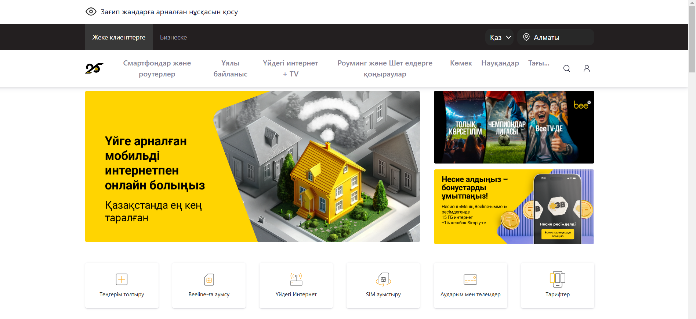
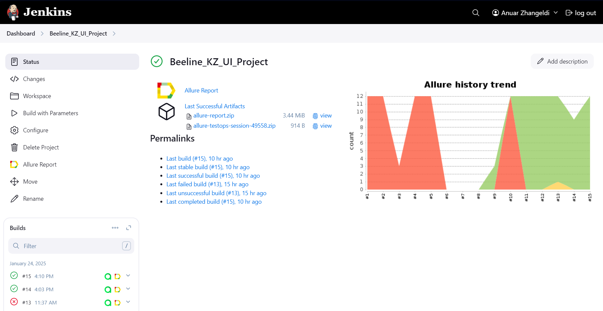
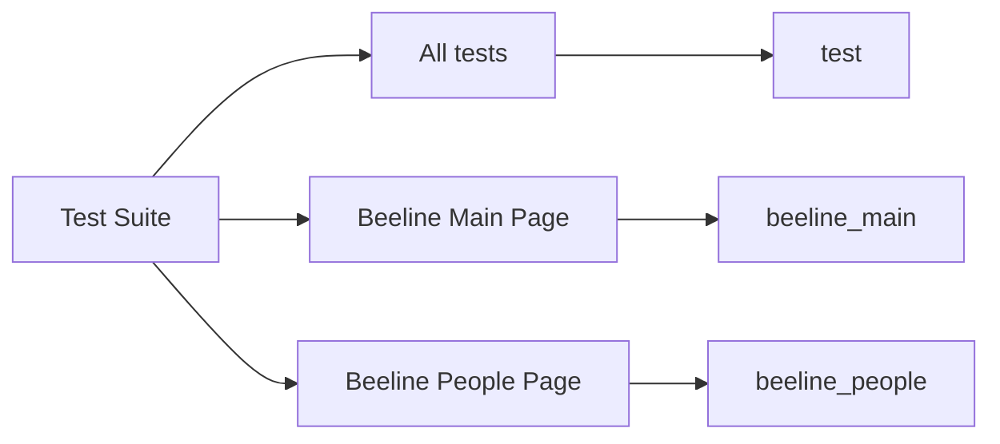
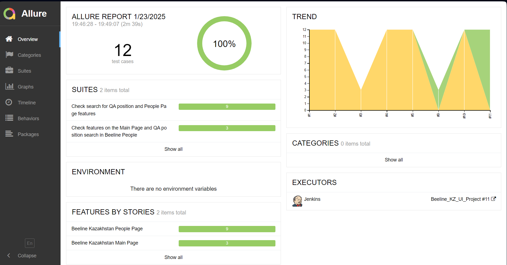
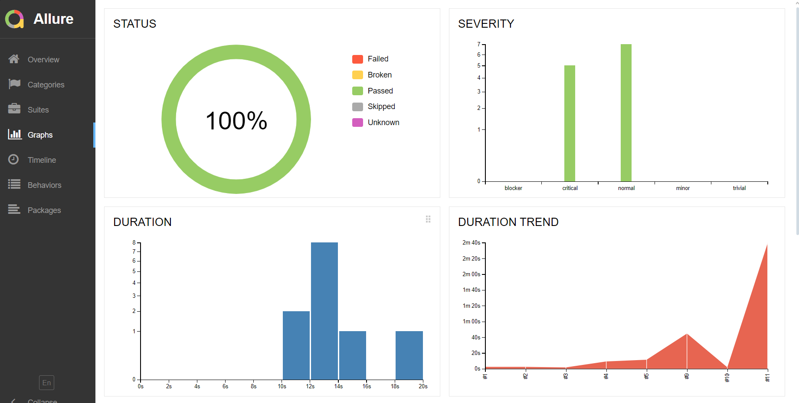
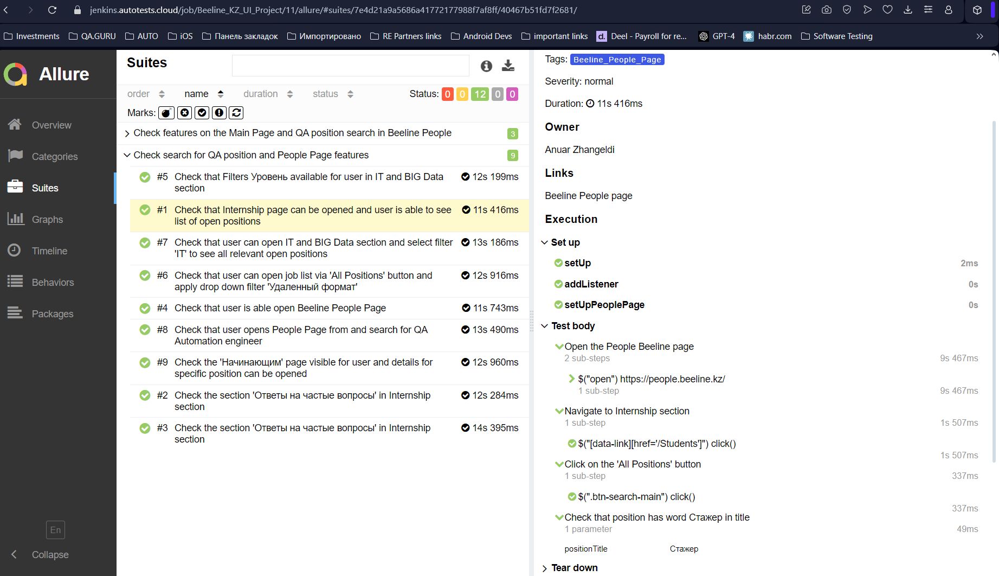
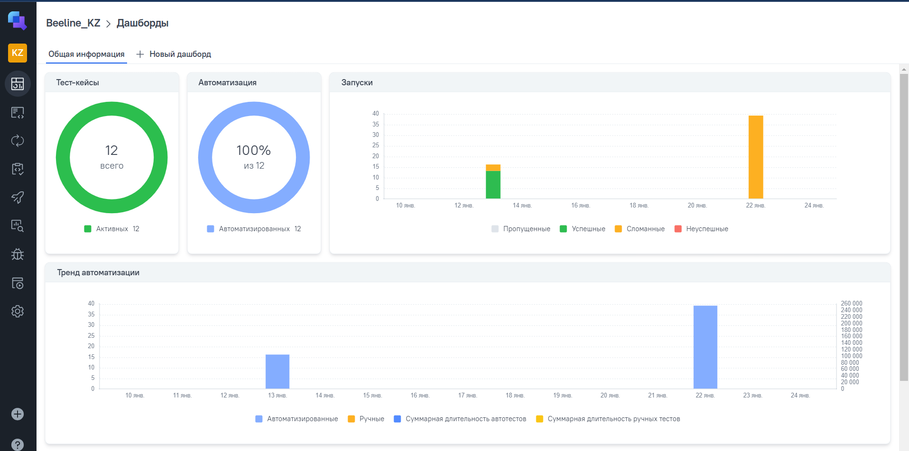
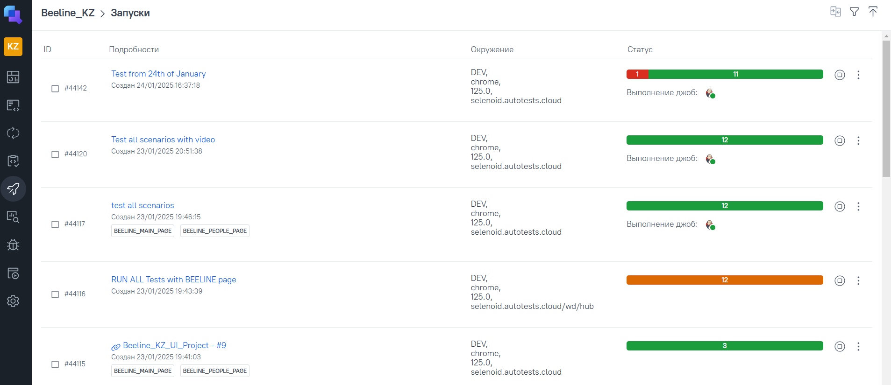
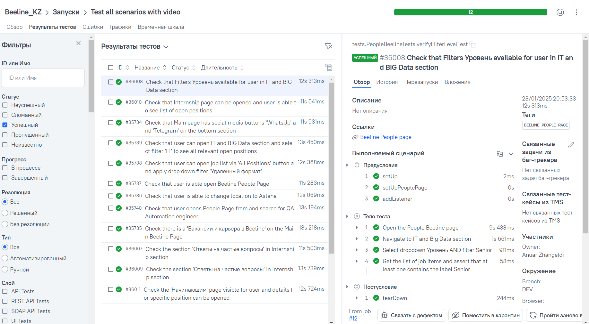
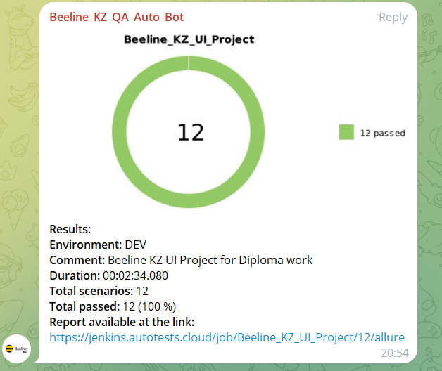

# Beeline Kazakhstan - UI Project for QA.GURU 

Automated tests for the [Beeline Kazakhstan](https://beeline.kz) website, focusing on navigation, elements visibility,
**Вакансии и карьера в Beeline**.

This project aims to ensure high-quality standards for Beeline's online presence by automating critical UI functionalities and offering seamless integration with modern tools like Jenkins, Allure Reports, and TestOps.

---

## Beeline Main Pages Overview

**Beeline Main Page**



**Beeline People Page**


---

## Features

This project leverages cutting-edge automation tools and frameworks to deliver a robust testing suite. Below are the key features:

- **Automation Framework**: [Selenide](https://selenide.org) with Java for efficient UI interaction.
- **Testing**: JUnit5 is used for a structured and organized approach to testing.
- **Reporting**: [Allure Reports](https://docs.qameta.io/allure/) provides detailed insights into test execution results.
- **CI/CD**: Jenkins powers automated test executions with customizable parameters.
- **Notifications**: Telegram integration ensures real-time alerts about test statuses and results.
- **Video Recordings**: Selenoid enables video playback of test executions for debugging and analysis.

<p align="left">
 


</p>

---

## Table of Contents

1. [Test Cases](#test-cases)
2. [Jenkins Integration](#jenkins-integration)
3. [Allure Reports](#allure-reports)
4. [TestOps Integration](#testops-integration)
5. [Telegram Notifications](#telegram-notifications)
6. [Test Execution Video from Selenoid](#test-execution-video-from-selenoid)
7. [Test Parameters Overview](#test-parameters-overview)

---

## Test Cases

Below is a detailed breakdown of test cases automated within this project:

| ID   | Test Case Description                                                                                 | Expected Result                                                                                                                          |
|------|-------------------------------------------------------------------------------------------------------|------------------------------------------------------------------------------------------------------------------------------------------|
| TC01 | **Confirm 'WhatsUp' and 'Telegram' buttons appear on the main page**                                  | Support buttons are displayed and easily visible for users on the Beeline Main Page.                                                     |
| TC02 | **Validate location selection functionality on the main page**                                        | Ensure the user can switch the location to Astana successfully.                                                                          |
| TC03 | **Ensure 'Вакансии и карьера в Beeline' link is present in the footer**                               | Verify that the "Вакансии и карьера в Beeline" link exists, is visible, and can be accessed in the footer section.                       |
| TC04 | **Verify accessibility of the Beeline People page**                                                   | Ensure the user can navigate to the [Beeline People Page](https://people.beeline.kz).                                                    |
| TC05 | **Search for QA Automation Engineer position on Beeline People page**                                 | Confirm that the user can search for a QA Automation Engineer job and access its details.                                                |
| TC06 | **Validate job search using quick filters in the IT and Big Data section**                            | Ensure the user can access the IT and Big Data section and apply the 'IT' filter to view all relevant openings.                          |
| TC07 | **Test job search functionality with 'All Positions' button and filter options (Remote work format)** | Confirm the user can open the job list via the 'All Positions' button and apply the 'Удаленный формат' filter.                           |
| TC08 | **Check that the Internship page displays available positions**                                       | Verify that the user can view a list of open positions containing the word "Стажер".                                                     |
| TC09 | **Validate 'Уровень' filter functionality in the IT and Big Data section**                            | Filtered job listings include positions labeled as "SENIOR".                                                                             |
| TC10 | **Ensure the visibility of the Начинающим page and access to specific career fields**                 | Confirm the page displays the text "Начни свою карьеру вместе с Beeline Казахстан" and allows navigation to specific work field details. |
| TC11 | **Verify visibility of the FAQ section on the Internship page**                                       | Confirm that users can reveal hidden answers to questions in the "Ответы на частые вопросы" section.                                     |
| TC12 | **Ensure the 'Остались вопросы?' section is displayed at the bottom of the page**                     | Verify that the bottom section contains a visible title and a button for users to connect with support.                                  |
| TC13 | **Check search functionality with valid data on the Beeline Main Page**                               | Verify that Search functionality from the Main Page works with valid data and relevant result can be opened                              |
| TC14 | **Check More button and Fraud section with FAQ from the Main Page**                                   | User should be able to see expanded answer for selected question from Fraud page                                                         |

---

## Jenkins Integration

Jenkins is seamlessly integrated into this project to enable Continuous Integration and Continuous Deployment (CI/CD). The Jenkins pipeline facilitates automated test executions based on specific configurations and ensures a smooth development workflow.

**Jenkins Build Link**: [Beeline KZ Jenkins Project](https://jenkins.autotests.cloud/job/Beeline_KZ_UI_Project/)

**Parameters to launch the Build:**

| Parameter             | Description                                                           |
|-----------------------|-----------------------------------------------------------------------|
| **BROWSER_NAME**      | The browser used to launch the build.                                 |
| **BROWSER_VERSION**   | The version of the browser used for launching the build.              |
| **BROWSER_SIZE**      | The resolution of the browser window.                                 |
| **REMOTE_URL**        | The URL of the remote server for build execution.                     |
| **REMOTE_VIDEO_URL**  | The URL of the remote server hosting the video recordings.            |
| **ENVIRONMENT**       | The environment where the build will be executed.                     |
| **TASK**              | The task to be selected for running a specific combination of tests.  |

**Jenkins Build Status Screenshot:**



---

## Command to Launch Tests

### Remote Launch (using Jenkins and Selenoid)
Requires authentication (login and password). Use the following command:

```bash
gradle clean test -Denv=remote
```

### Local Launch
To execute tests locally, use:

```bash
gradle clean test
```

## Test Parameters Overview

Below is a visual representation of the test suite and associated parameters:



---
## Allure Reports

Allure Reports provide a comprehensive overview of test execution results, including detailed logs, graphs, and individual test steps. This project uses Allure to ensure full traceability and transparency in test outcomes.

To view Allure reports:
1. Execute tests to generate the report: `mvn clean test`
2. Generate the Allure report: `allure serve target/allure-results`

**Allure Report Overview:**

**Allure Report Link**: [Beeline KZ Allure Report](https://jenkins.autotests.cloud/job/Beeline_KZ_UI_Project/allure/)



**Graphical Representation in Allure Reports:**



**Test Steps:**



---

## TestOps Integration

Allure TestOps extends the reporting capabilities by offering advanced analytics and dashboards. It allows tracking launches, detailed test cases, and overall project health in a centralized platform.

**TestOps Project Link**: [Beeline KZ TestOps](https://allure.autotests.cloud/project/4555/launches)

**Dashboard Screenshot:**



**Launches Overview in TestOps:**



**Test Case Management in TestOps:**



---

## Telegram Notifications

Telegram is integrated to notify the team about test execution results. 
Notifications include:
- Overall test status (Pass/Fail)
- Summary of executed tests
- Links to detailed reports for easy debugging

**Example Telegram Notification:**



---

## Test Execution Video from Selenoid

Selenoid is utilized for cross-browser testing and video recording.
It records every test execution, aiding in debugging and providing a visual representation of test steps.

1. Videos are accessible via Jenkins or a specified server path.
2. They offer invaluable insights into test execution flows and failures.

**Example Test Execution Video:**

https://github.com/user-attachments/assets/92193ae6-beb3-4cb5-b5d9-4092e39c6022

---