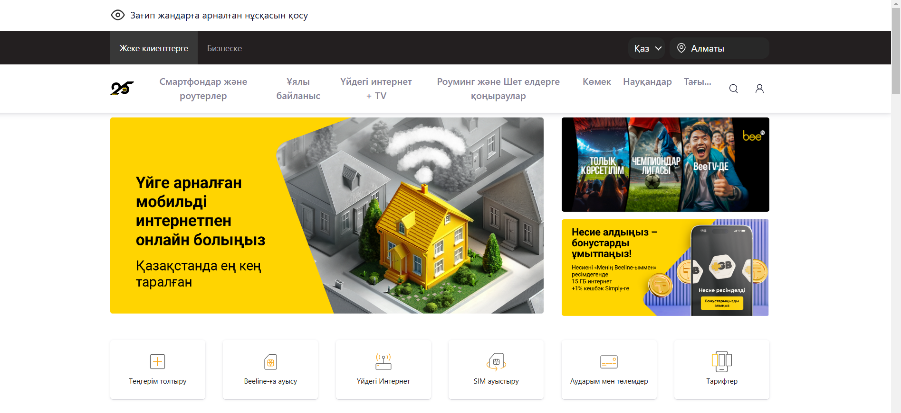
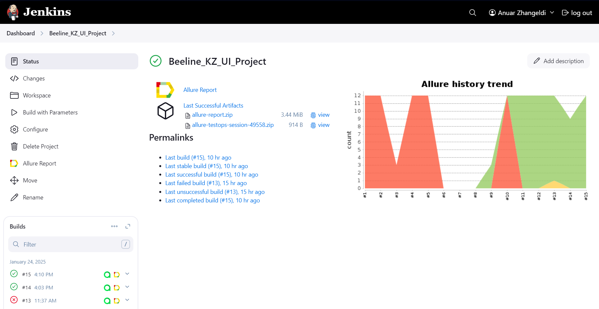
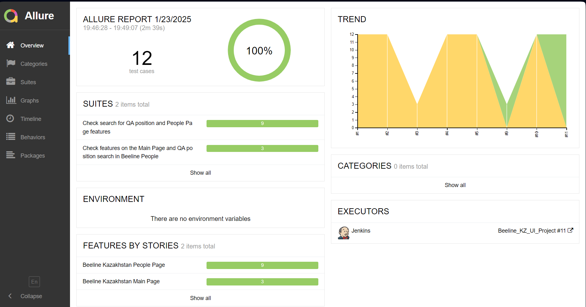
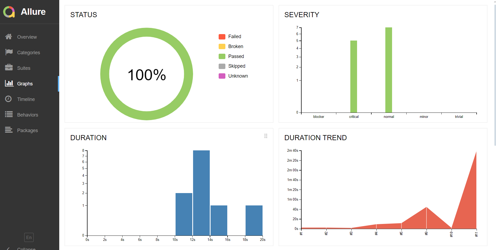
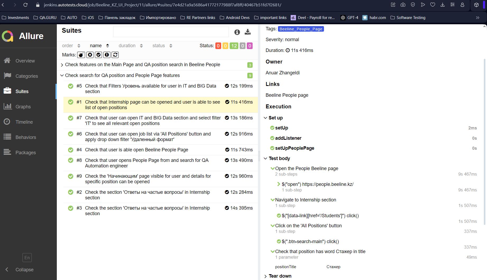
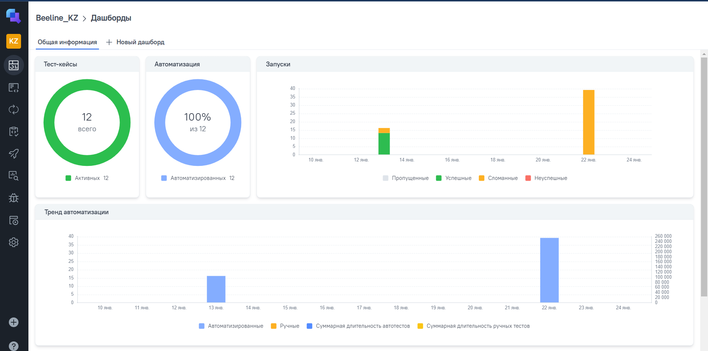
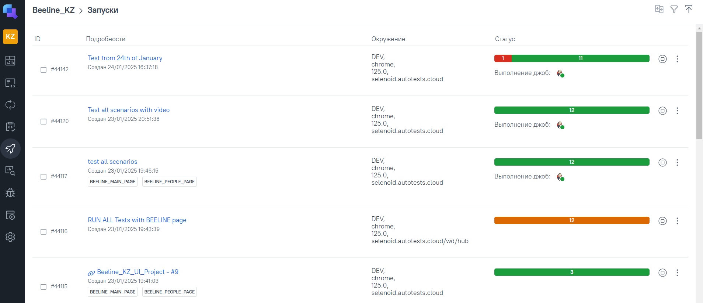
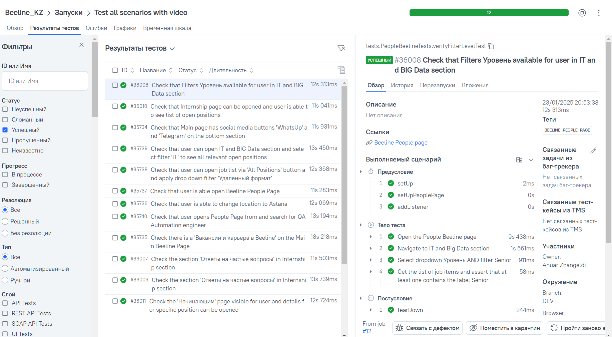
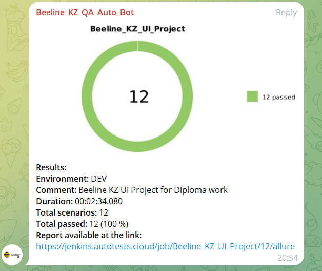

# Beeline Kazakhstan - UI Project for QA.GURU 

Automated tests for the [Beeline Kazakhstan](https://beeline.kz) website, focusing on navigation, elements visibility, 
**Вакансии и карьера в Beeline**.

**Beeline Main Page**

**Beeline People Page**

## Features

- **Automation Framework**: [Selenide](https://selenide.org) with Java
- **Testing**: JUnit5 for structured testing
- **Reporting**: [Allure Reports](https://docs.qameta.io/allure/)
- **CI/CD**: Jenkins for automated test execution under the specific parameters
- **Notifications**: Telegram for real-time alerts on test results
- **Video Recordings**: Selenoid to capture test execution videos

---

## Table of Contents

1. [Test Cases](#test-cases)
2. [Allure Reports](#allure-reports)
3. [Telegram Notifications](#telegram-notifications)
4. [Test Execution Video from Selenoid](#test-execution-video-from-selenoid)

---

## Test Cases

| ID   | Test Case Description                                                                                 | Expected Result                                                                                                                          |
|------|-------------------------------------------------------------------------------------------------------|------------------------------------------------------------------------------------------------------------------------------------------|
| TC01 | **Confirm 'WhatsUp' and 'Telegram' buttons appear on the main page**                                  | Support buttons are displayed and easily visible for users on the Beeline Main Page.                                                     |
| TC02 | **Validate location selection functionality on the main page**                                        | Ensure the user can switch the location to Astana successfully.                                                                          |                                                                   |                                                                                                                                      |
| TC03 | **Ensure 'Вакансии и карьера в Beeline' link is present in the footer**                               | Verify that the "Вакансии и карьера в Beeline" link exists, is visible, and can be accessed in the footer section.                       |
| TC04 | **Verify accessibility of the Beeline People page**                                                   | Ensure the user can navigate to the [Beeline People Page](https://people.beeline.kz).                                                    |
| TC05 | **Search for QA Automation Engineer position on Beeline People page**                                 | Confirm that the user can search for a QA Automation Engineer job and access its details.                                                |
| TC06 | **Validate job search using quick filters in the IT and Big Data section**                            | Ensure the user can access the IT and Big Data section and apply the 'IT' filter to view all relevant openings.                          |
| TC07 | **Test job search functionality with 'All Positions' button and filter options (Remote work format)** | Confirm the user can open the job list via the 'All Positions' button and apply the 'Удаленный формат' filter.                           |
| TC08 | **Check that the Internship page displays available positions**                                       | Verify that the user can view a list of open positions containing the word "Стажер".                                                     |
| TC09 | **Validate 'Уровень' filter functionality in the IT and Big Data section**                            | Filtered job listings include positions labeled as "SENIOR".                                                                             |
| TC10 | **Ensure the visibility of the Начинающим page and access to specific career fields**                 | Confirm the page displays the text "Начни свою карьеру вместе с Beeline Казахстан" and allows navigation to specific work field details. |
| TC11 | **Verify visibility of the FAQ section on the Internship page**                                       | Confirm that users can reveal hidden answers to questions in the "Ответы на частые вопросы" section.                                     |
| TC12 | **Ensure the 'Остались вопросы?' section is displayed at the bottom of the page**                     | Verify that the bottom section contains a visible title and a button for users to connect with support.                                  |

---

## Jenkins Project

**Parameters to launch the Build:**

| Parameter             | Description                                                           |
|-----------------------|-----------------------------------------------------------------------|
| **BROWSER_NAME**      | The browser used to launch the build.                                 |
| **BROWSER_VERSION**   | The version of the browser used for launching the build.              |                                                                                                                                      |
| **BROWSER_SIZE**      | The resolution of the browser window.                                 |
| **REMOTE_URL**        | The URL of the remote server for build execution.                     |
| **REMOTE_VIDEO_URL**  | The URL of the remote server hosting the video recordings.            |
| **ENVIRONMENT**       | The environment where the build will be executed.                     |
| **TASK**              | The task to be selected for running a specific combination of tests.  |

## Allure Reports

Allure Reports provide clear insights into test results, including success/failure rates, test durations, and individual test steps. The report is generated after each test run and is accessible via Jenkins or as a standalone HTML report.

To view Allure reports:
1. Execute tests to generate the report: `mvn clean beeline_test`
2. Generate the Allure report: `allure serve target/allure-results`

**Example of Allure Report:**

**Allure Report Graphs:**

**Example of Test Case Steps from Allure Report:**

---
**Allure TestOps Integration:**

**Allure TestOps Launches Page:**

**Allure TestOps Test cases page:**

---
## Telegram Notifications

Notifications are set up via a relevant Telegram bot specified on Beeline KZ, alerting the team on test completion and results:
- Pass/Fail status
- Summary of tests executed, including failed tests
- Quick links to detailed reports

**Telegram Notification for Beeline KZ**  

---

## Test Execution Video from Selenoid

Selenoid is used for cross-browser testing and video recording, enabling real-time playback for test executions to aid in debugging and verification.

1. Each test execution is recorded.
2. Videos are stored and can be accessed in Jenkins or a specified server path.

**Example Test Execution Video:**

https://github.com/user-attachments/assets/92193ae6-beb3-4cb5-b5d9-4092e39c6022

---
